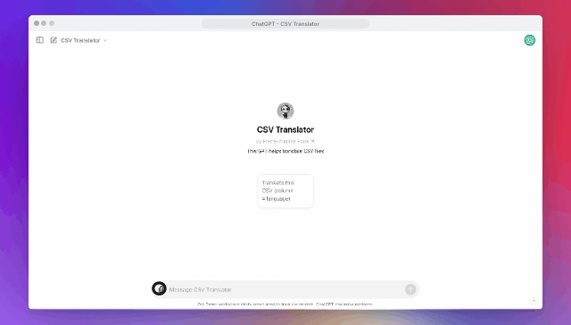

# GPT Action - Batch translation with OpenAI Chat API

This code+integration enables you to translate CSV files that
1. Are in one language and want to be translated fully into another *(e.g: a CSV with data in French that you want to have in English)*
2. Have a column of sentences to translate *(with all rows filled for this column)*, and other columns *(empty rows)* for which you'd like to get the translation for.

## Workflow demo (2nd use-case)



## Workflow

This function:
- Downloads CSVs following [ChatGPT's Actions file format ](https://platform.openai.com/docs/actions/sending-files)
- Get unique values of cells so it doesn't translate multiple time the same value
- Transform CSVs into batches of request, broke down per language and per number of rows to translate, configurable with variables in the script
- Get completion (concurrently for higher speed) by calling OpenAI API
- Return the CSV translated


## Deploy this function

Configure your OpenAI API key. Copy the env.example.yml and copy your own API key.

```
cp env.example.yml env.yml
```

Deploy the function to Google Cloud. The following command uses the Google CLI, requires you to be authenticated. It also allows anyone to connect without authentication to your function, which you should avoid and tend to prefer authenticated request (Read more on https://cloud.google.com/functions/docs/securing/authenticating).

```
gcloud functions deploy translateHandler \
  --runtime nodejs18 \
  --trigger-http \
  --allow-unauthenticated \
  --env-vars-file env.yml
```

_PS: feel free to re-use the code for another provider, the format might be a little bit different in exports/deployment files but the code will stay similar_

## Testing

An example payload will look like for 1st use-case:

```
{
    "language": "english",
    "openaiFileIdRefs": [
      {
        "name": "my_file.csv",
        "id": "file-xxxxx",
        "mime_type": "text/csv",
        "download_link": "https://files.oaiusercontent.com/file-xxxx?with-all-the-signed-parameters-from-oai"
      }
    ]
  }
```

or for 2nd use case:

```
{
    "openaiFileIdRefs": [
      {
        "name": "my_file.csv",
        "id": "file-xxxxx",
        "mime_type": "text/csv",
        "download_link": "https://files.oaiusercontent.com/file-xxxx?with-all-the-signed-parameters-from-oai"
      }
    ]
  }
```

To test it locally, you can run `npm start` and don't necessarily need a file hosted on OpenAI/ChatGPT but can use any URL of file you have access to.

## CSV format expected

For the first use-case, no format are expected, we'll just translate the CSV. For the second use-case, check out `random_sentences_creative_final.csv` in this repository, it looks like this:

```
english, a_language, another_language,
a_sentence,,,
```

where the empty cells will be translated.

## Use it with a GPT

1. Create a custom GPT
2. Set-up instructions, a (poor, [check out this guide](https://platform.openai.com/docs/guides/prompt-engineering)) example can be:

```
You help a user translate text by leveraging the "translate" operation defined in Actions/Functions. You never help user directly, you always translate by using the translateTool and output exactly what this tool is giving you.

1. Identify file format
2. use translate operation
3. show user's translation

## First step

Identify which is the format of the CSV, either CSV with language columns or CSV without. 

### Format with language column

If the CSV contains language headers (you can check the first row) then send the file to the API (using translate operation and by populating the openaiFileIdRefs with the CSV the user has uploaded) directly.

### Format for one-off translation

If the CSV doesn't have language headers in the first row and the CSV is full (most cells are full and not empty) it means the user wants to translate this in-place in another language. For this, ask the language to the user for which they'd like to translate, and then send this to the API as the "language" parameter alongside the file (full text language, not ISO code).

## Output

Once you receive the translated file back, use code analysis and the "df.head()" method to show the first 10 rows of the CSV you received to the user in the chat so they get an idea of what's in it and let them know they can download it to view it in full.
```

3. Set-up an Action

```
openapi: 3.1.0
info:
  title: Translation API
  description: An API that translates text or CSV file content into a target language.
  version: 1.0.0
servers:
  - url: https://{your_function_url}.cloudfunctions.net
paths:
  /translateHandler:
    post:
      operationId: translate
      summary: Translates text or CSV file content into the specified target language.
      description: |
        This endpoint allows you to translate plain text or the content of a CSV file into a specified target language. 
        For CSV files, the `openaiFileIdRefs` parameter is used to reference the file(s) to be translated.
      requestBody:
        required: true
        content:
          application/json:
            schema:
              type: object
              properties:
                language:
                  type: string
                  optional: true
                  example: english
                openaiFileIdRefs:
                  type: array
                  items:
                    type: string
      responses:
        '200':
          description: The translation was successful.
          content:
            text/csv:
              schema:
                type: string
                format: binary
                description: The translated CSV file, sent as an attachment.
        '400':
          description: Bad Request. The request was invalid, missing parameters, or contained invalid data.
          content:
            application/json:
              schema:
                type: object
                properties:
                  error:
                    type: string
                    example: 'Missing target language parameter "lang".'
        '500':
          description: Internal Server Error. An unexpected error occurred during processing.
          content:
            application/json:
              schema:
                type: object
                properties:
                  error:
                    type: string
                    example: 'Internal Server Error'
```
