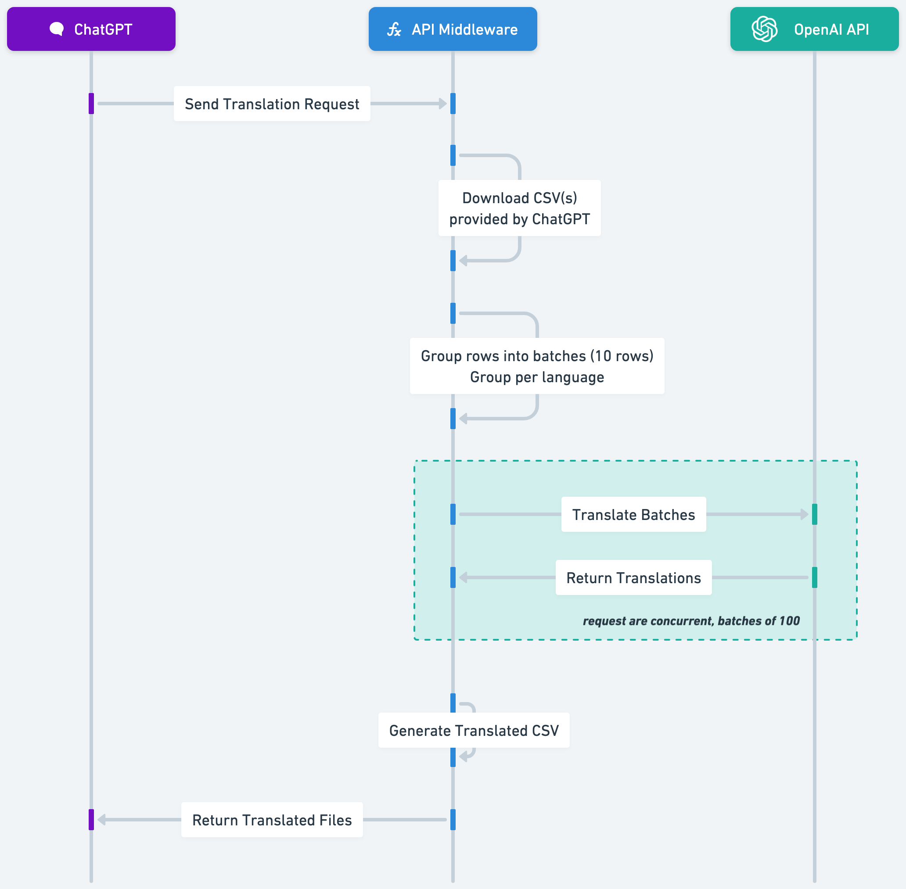

# GPT Action - Batch translation with OpenAI Chat API

This function:
- Downloads CSVs following [ChatGPT's Actions file format ](https://platform.openai.com/docs/actions/sending-files)
- Transform CSVs into batches of request, broke down per language and per number of rows to translate, configurable with variables in the script
- Get completion (concurrently for higher speed) by calling OpenAI API
- Return the CSV translated

{ width: 400px; }

## Deploy this function

Configure your OpenAI API key. Copy the env.example.yml and copy your own API key.

```
cp env.example.yml env.yml
```

Deploy the function to Google Cloud. The following command uses the Google CLI, requires you to be authenticated. It also allows anyone to connect without authentication to your function, which you should avoid and tend to prefer authenticated request (Read more on https://cloud.google.com/functions/docs/securing/authenticating).

```
gcloud functions deploy translateHandler \
  --runtime nodejs18 \
  --trigger-http \
  --allow-unauthenticated \
  --env-vars-file env.yml
```

_PS: feel free to re-use the code for another provider, the format might be a little bit different in exports/deployment files but the code will stay similar_

## Testing

An example payload will look like:

```
{
    "openaiFileIdRefs": [
      {
        "name": "my_file.csv",
        "id": "file-xxxxx",
        "mime_type": "text/csv",
        "download_link": "https://files.oaiusercontent.com/file-xxxx?with-all-the-signed-parameters-from-oai"
      }
    ]
  }
```

To test it locally, you can run `npm start` and don't necessarily need a file hosted on OpenAI/ChatGPT but can use any URL of file you have access to.

## CSV format expected

Check out `random_sentences_creative_final.csv`, it looks like this:

```
english, a_language, another_language,
a_sentence,,,
```

where the empty cells will be translated.

## Use it with a GPT

1. Create a custom GPT
2. Set-up instructions, a (poor, [check out this guide](https://platform.openai.com/docs/guides/prompt-engineering)) example can be:

```
You help a user translate text by leveraging the "translate" operation defined in Actions/Functions. You always translate by using the translateTool and output exactly what this tool is giving you.

## The user will send a CSV
Send the file to the API (using translate operation and by populating the openaiFileIdRefs with the CSV the user has uploaded). Don't ask for any language, it should be specified in the sheet and the translation service will return it translated.

Once you receive the translated file back, use code analysis and the "df.head()" method to show the first 10 rows of the CSV you received to the user in the chat so they get an idea of what's in it and let them know they can download it to view it in full.
```

3. Set-up an Action

```
openapi: 3.1.0
info:
  title: Translation API
  description: An API that translates CSV file content into a target language.
  version: 1.0.0
servers:
  - url: https://{your_function_url}.cloudfunctions.net
paths:
  /translateHandler:
    post:
      operationId: translate
      summary: Translates text or CSV file content into the specified target language.
      description: |
        This endpoint allows you to translate plain text or the content of a CSV file into a specified target language. 
        For CSV files, the `openaiFileIdRefs` parameter is used to reference the file(s) to be translated.
      requestBody:
        required: true
        content:
          application/json:
            schema:
              type: object
              properties:
                openaiFileIdRefs:
                  type: array
                  items:
                    type: string
      responses:
        '200':
          description: The translation was successful.
          content:
            text/csv:
              schema:
                type: string
                format: binary
                description: The translated CSV file, sent as an attachment.
        '400':
          description: Bad Request. The request was invalid, missing parameters, or contained invalid data.
          content:
            application/json:
              schema:
                type: object
                properties:
                  error:
                    type: string
                    example: 'Missing target language parameter "lang".'
        '500':
          description: Internal Server Error. An unexpected error occurred during processing.
          content:
            application/json:
              schema:
                type: object
                properties:
                  error:
                    type: string
                    example: 'Internal Server Error'
```
